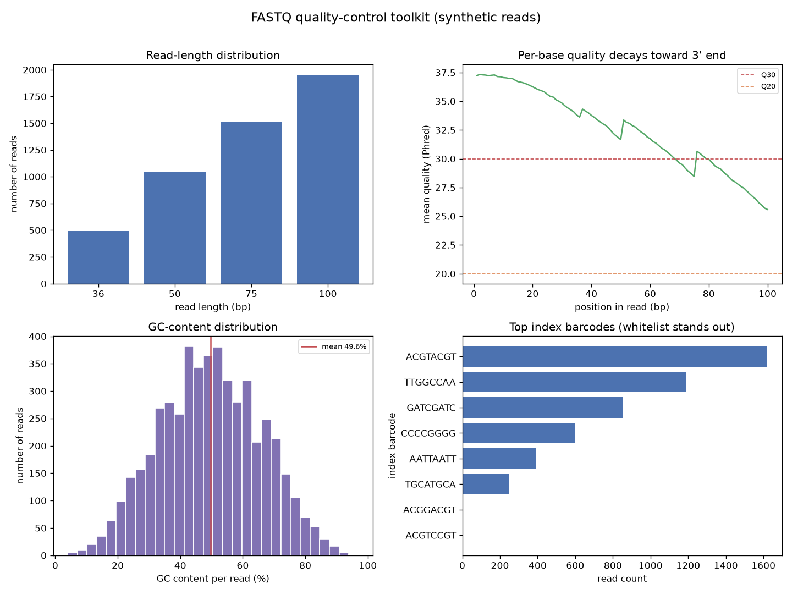

# FASTQ Quality Control Toolkit

Before you align a single read, the FASTQ file already knows whether your experiment worked. Read lengths, per-base quality, GC content, and barcode balance are the four vital signs of a sequencing run — and for decades bioinformaticians have read them straight off the command line with a handful of awk and sed one-liners. This project turns those one-liners into a small, testable Python toolkit and shows what each metric is really telling you.

## Demo Output



`demo.py` writes its own synthetic FASTQ file (5,000 reads) and then reproduces the four core QC plots from it. No downloads, no reference genome, no external tools.

## Why This Exists

Everyone runs FastQC, few people can say what its plots *mean* or reproduce them by hand. That gap matters: when a run looks wrong, the person who understands the underlying counts fixes it in minutes, and the person who only knows the button waits for someone else. Each metric here maps directly to a classic Tommy Tang one-liner, so you can see the exact operation underneath the plot.

| Metric | The Unix one-liner it comes from | What it catches |
|---|---|---|
| Read-length distribution | `awk 'NR%4==2 {lengths[length($0)]++}'` | Truncated reads, over-aggressive trimming |
| Per-base quality | decode Phred+33 per position | 3'-end quality collapse, bad cycles |
| GC content | count G/C per read | Contamination, adapter dimers, wrong species |
| Barcode frequency | `sed -n '2~4p' \| sort \| uniq -c \| sort -nr` | Index hopping, demultiplexing failures |

## How It Works

1. **Read-length distribution.** A FASTQ record is four lines; the sequence is every 4th line starting at line 2. Counting lengths reveals whether reads are uniform or a trimming step ate into them. The demo plants a known length mixture and recovers it exactly.
2. **Per-base quality.** Decoding the Phred+33 quality string at each position and averaging across reads produces the single most useful QC plot: mean quality by cycle. The demo bakes in the familiar Illumina decay toward the 3' end, so quality slides from Q38 down past Q30 — the point where many pipelines trim.
3. **GC content.** The per-read GC histogram should be a tidy bell around the organism's genome-wide GC. A second peak or a long tail is the fingerprint of contamination or adapter dimers.
4. **Barcode frequency.** Extracting the index sequence from every read and tallying it (the `sort | uniq -c | sort -nr` idiom) shows whether your samples are balanced. The whitelisted barcodes tower over the low-frequency error variants — exactly the shape you check before trusting demultiplexing.

## When NOT to Use This

This is a *teaching and triage* toolkit, not a replacement for FastQC/MultiQC in a production pipeline — those handle gzip streaming, adapter detection, and edge cases you do not want to reimplement at scale. Reach for the real tools on real runs; reach for this when you need to understand, debug, or demonstrate what those tools are computing.

## The Uncomfortable Truth

Most "the aligner is broken" tickets are really "nobody looked at the FASTQ." Two minutes with these four plots catches truncated reads, contamination, and botched demultiplexing before they waste a day of downstream analysis. QC is not the boring part you skip to get to the science — it *is* the science's foundation.

## Run It

```bash
pip install -r requirements.txt
python demo.py
```

`fastq_qc.py` exposes `parse_fastq`, `read_length_distribution`, `gc_content`, `per_base_quality`, and `barcode_frequency` — each a drop-in, importable version of the corresponding one-liner.

## Further Reading

Inspired by Ming 'Tommy' Tang, *60 Useful Bioinformatics Unix One-liners* and the Unix chapters of *From cell line to command line* (https://divingintogeneticsandgenomics.com/).

> Demonstrated on synthetic data, so the whole thing is reproducible with no external downloads.
